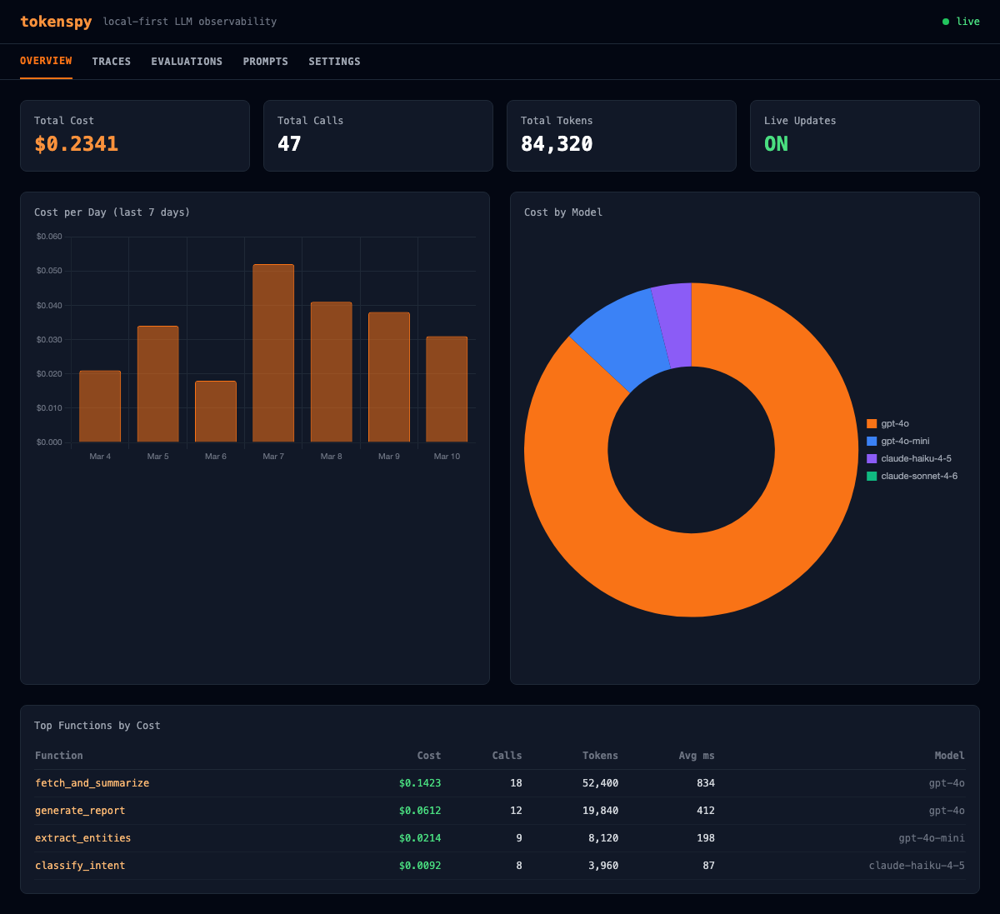
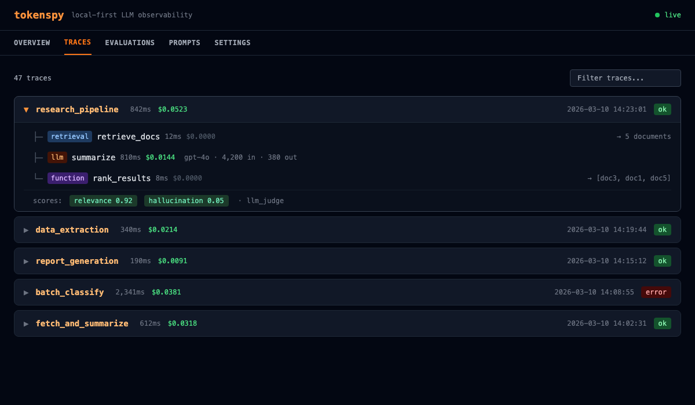

# tokenspy 🔥

<div align="center">

**The local-first LLM observability stack. No cloud. No signup. No proxy.**

*Cost profiling · Structured tracing · Evaluations · Prompt versioning · Live dashboard*

[](https://pypi.org/project/tokenspy/)
[](https://github.com/pinakimishra95/tokenspy/actions)
[](https://www.python.org/downloads/)
[](https://opensource.org/licenses/MIT)
[](https://pypi.org/project/tokenspy/)

```bash
pip install tokenspy
```

</div>

---

## The Problem

You get an OpenAI invoice. It says **$800 this month**. You have no idea which function caused it.

```python
def run_pipeline(query):
    docs = fetch_and_summarize(query)    # ← costs $600?
    entities = extract_entities(docs)   # ← or this one?
    return generate_report(entities)    # ← or this one?
```

Langfuse and Braintrust force you to reroute traffic through their cloud proxy. Sign up. Configure API keys. Break your local setup. Pay monthly.

**tokenspy is your local alternative. One line. Runs entirely on your machine. Forever free.**

---

## What's New in v0.2.0 — Full Observability Stack

tokenspy now covers everything Langfuse and Braintrust do — without sending a single byte to the cloud.

| Feature | v0.1 | v0.2.0 |
|---|---|---|
| Cost flame graph | ✅ | ✅ |
| Budget alerts | ✅ | ✅ |
| SQLite persistence | ✅ | ✅ |
| **Structured tracing (Trace + Span)** | ❌ | ✅ |
| **OpenTelemetry export** | ❌ | ✅ |
| **Evaluations + datasets** | ❌ | ✅ |
| **Prompt versioning** | ❌ | ✅ |
| **Live web dashboard** | ❌ | ✅ |

---

## Feature 1: Cost Profiling (the original)

```python
import tokenspy

@tokenspy.profile
def run_pipeline(query):
    docs = fetch_and_summarize(query)
    entities = extract_entities(docs)
    return generate_report(entities)

run_pipeline("Analyze Q3 earnings")
tokenspy.report()
```

**Terminal output:**

```
╔══════════════════════════════════════════════════════════════════════╗
║  tokenspy cost report                                                ║
║  total: $0.0523  ·  18,734 tokens  ·  3 calls                       ║
╠══════════════════════════════════════════════════════════════════════╣
║                                                                      ║
║  fetch_and_summarize      $0.038  ████████████░░░░  73%             ║
║    └─ gpt-4o               $0.038  ████████████░░░░  73%            ║
║       └─ 12,000 tokens                                               ║
║                                                                      ║
║  generate_report          $0.011  ████░░░░░░░░░░░░  21%            ║
║    └─ gpt-4o               $0.011  ████░░░░░░░░░░░░  21%            ║
║       └─ 3,600 tokens                                                ║
║                                                                      ║
║  extract_entities         $0.003  █░░░░░░░░░░░░░░░   6%            ║
║    └─ gpt-4o-mini          $0.003  █░░░░░░░░░░░░░░░   6%            ║
║       └─ 3,134 tokens                                                ║
║                                                                      ║
╠══════════════════════════════════════════════════════════════════════╣
║  Optimization hints                                                  ║
║                                                                      ║
║  🔴 fetch_and_summarize [gpt-4o]                                     ║
║     Switch to gpt-4o-mini — 94% cheaper  (~$540/month savings)      ║
╚══════════════════════════════════════════════════════════════════════╝
```

**Now you know: `fetch_and_summarize` is burning 73% of your budget. Fix that one function.**

---

## Feature 2: Structured Tracing

> See *exactly* what happens inside every LLM call — inputs, outputs, tokens, latency — organized into a tree of spans, just like Langfuse.

### How it works

```
Your Code
    │
    ├── tokenspy.trace("research_pipeline")          ← top-level trace
    │       │
    │       ├── tokenspy.span("retrieve_docs")        ← child span
    │       │       └── vector_store.search(...)
    │       │
    │       ├── tokenspy.span("summarize", "llm")     ← LLM span
    │       │       └── client.chat.completions.create(...)
    │       │               │
    │       │               └── tokenspy interceptor auto-links:
    │       │                     model, input_tokens, output_tokens,
    │       │                     cost_usd, duration_ms → span record
    │       │
    │       └── tokenspy.span("rank_results")
    │
    └── t.score("relevance", 0.92)                   ← attach score
```

**LLM calls made inside a span are automatically linked** — no manual wiring.

### Code example

```python
import tokenspy

tokenspy.init(persist=True)   # save traces to ~/.tokenspy/usage.db

with tokenspy.trace("research_pipeline", input={"query": "climate change"}) as t:

    with tokenspy.span("retrieve_docs", span_type="retrieval") as s:
        docs = vector_store.search("climate change", top_k=5)
        s.update(output={"n_docs": len(docs), "sources": [d.title for d in docs]})

    with tokenspy.span("summarize", span_type="llm") as s:
        # Any LLM call here is AUTOMATICALLY attributed to this span
        response = openai.chat.completions.create(
            model="gpt-4o",
            messages=[{"role": "user", "content": f"Summarize: {docs}"}]
        )
        s.update(output=response.choices[0].message.content)

    with tokenspy.span("rank_results", span_type="function") as s:
        ranked = rerank(docs, response)
        s.update(output=ranked[:3])

    t.update(output=ranked[:3])

# Attach quality scores after the fact
t.score("relevance", 0.92, scorer="human")
t.score("hallucination", 0.05, scorer="llm_judge", comment="Grounded in sources")
```

### What gets recorded per span

```
Span: summarize
  ├── span_type:     llm
  ├── start_time:    2026-03-10 14:23:01.412
  ├── duration_ms:   842
  ├── model:         gpt-4o               ← auto-linked from LLM call
  ├── input_tokens:  4,200                ← auto-linked
  ├── output_tokens: 380                  ← auto-linked
  ├── cost_usd:      $0.0144              ← auto-linked
  ├── status:        ok
  └── output:        "Climate change refers to..."
```

### Why tracing matters

**Without tracing:**
```
cost report: run_pipeline → $0.052 total, 3 calls
```
You know the total. You don't know *which step* took 800ms. You don't know what the retrieval returned. You can't replay it.

**With tracing:**
```
trace: research_pipeline  842ms  $0.052
  ├── retrieve_docs       12ms   $0.000  → returned 5 docs
  ├── summarize           810ms  $0.0144 → gpt-4o · 4,200 in · 380 out
  └── rank_results        8ms    $0.000  → [doc3, doc1, doc5]
  scores: relevance=0.92  hallucination=0.05
```
You see the full picture. You know retrieval was fast but the LLM was slow. You have the inputs and outputs for debugging. You can score the quality.

### Nested spans and async

Works with nested spans and async code — no changes needed:

```python
# Async works identically
async def run():
    async with tokenspy.trace("async_pipeline") as t:
        async with tokenspy.span("step1") as s:
            result = await async_llm_call()
            s.update(output=result)
```

---

## Feature 3: OpenTelemetry Export

Send tokenspy data to **Grafana, Jaeger, Datadog, Honeycomb** — any OTEL-compatible backend:

```python
tokenspy.init(
    persist=True,
    otel_endpoint="http://localhost:4317",   # your OTLP gRPC endpoint
    otel_service_name="my-llm-app",
)
```

```bash
pip install tokenspy[otel]
```

Every LLM call is exported as an OpenTelemetry span with standard attributes:

```
llm.openai.chat
  llm.request.model:           "gpt-4o"
  llm.usage.prompt_tokens:     4200
  llm.usage.completion_tokens: 380
  llm.usage.cost_usd:          0.0144
  code.function:               "summarize"
```

**What this unlocks:**
- Grafana dashboard: cost per minute, P95 latency, error rate
- Jaeger: distributed trace view across microservices
- Datadog: alert when cost per request exceeds threshold
- Any existing OTEL pipeline — tokenspy plugs straight in

---

## Feature 4: Evaluations + Datasets

Run your LLM functions against golden test sets and track quality over time — like Braintrust, but local.

```python
import tokenspy
from tokenspy.eval import scorers

tokenspy.init(persist=True)

# 1. Build a dataset
ds = tokenspy.dataset("qa-golden")
ds.add(input={"question": "Capital of France?"}, expected_output="Paris")
ds.add(input={"question": "Capital of Germany?"}, expected_output="Berlin")
ds.from_json("more_test_cases.json")   # bulk import

# 2. Define the function under test
@tokenspy.profile
def answer_question(input: dict) -> str:
    response = openai.chat.completions.create(
        model="gpt-4o-mini",
        messages=[{"role": "user", "content": input["question"]}]
    )
    return response.choices[0].message.content.strip()

# 3. Run the experiment
exp = tokenspy.experiment(
    "gpt4o-mini-baseline",
    dataset="qa-golden",
    fn=answer_question,
    scorers=[scorers.exact_match, scorers.contains],
)
results = exp.run()
results.summary()
```

**Terminal output:**

```
tokenspy — Experiment: gpt4o-mini-baseline
Dataset: qa-golden  (2 items)
────────────────────────────────────────────────────────
  ✓  Capital of France?     exact_match=1.0  contains=1.0  $0.0001  112ms
  ✓  Capital of Germany?    exact_match=1.0  contains=1.0  $0.0001   98ms
────────────────────────────────────────────────────────
  Passed:  2/2  (100.0%)
  Cost:    $0.0002
  Avg ms:  105
```

### LLM-as-judge scoring

```python
from tokenspy.eval import scorers

# Scores 0.0–1.0 using a small model as judge
judge = scorers.llm_judge(
    criteria="Is the answer factually accurate and concise?",
    model="gpt-4o-mini",
)

exp = tokenspy.experiment(
    "accuracy-check",
    dataset="qa-golden",
    fn=answer_question,
    scorers=[scorers.exact_match, judge],
)
results = exp.run()
```

### Compare experiments

```python
# After a prompt change, compare against the baseline
results.compare("gpt4o-mini-baseline")
```

```
Experiment comparison: gpt4o-mini-v2  vs  gpt4o-mini-baseline
────────────────────────────────────────────────
  exact_match:   0.95  →  0.80   ▼ 15%
  llm_judge:     0.88  →  0.91   ▲  3%
  cost:       $0.0002  →  $0.0003  ▲ 50%
  pass rate:    100%  →   80%    ▼ 20%
────────────────────────────────────────────────
```

---

## Feature 5: Prompt Versioning

Track every version of every prompt. Know exactly which prompt version caused a cost spike or quality drop.

```python
import tokenspy

tokenspy.init(persist=True)

# Push a new version (auto-increments: 1, 2, 3...)
p = tokenspy.prompts.push(
    "summarizer",
    "Summarize the following text in {{style}} style, max {{max_words}} words:\n\n{{text}}"
)
print(p.version)   # 1

# Compile with variables
compiled = p.compile(
    style="concise",
    max_words=100,
    text="Long document about climate change..."
)
# → "Summarize the following text in concise style, max 100 words:\n\nLong document..."

# Pull specific version or latest
p_latest = tokenspy.prompts.pull("summarizer")
p_v1     = tokenspy.prompts.pull("summarizer", version=1)
p_prod   = tokenspy.prompts.pull("summarizer", label="production")

# Mark a version as production
tokenspy.prompts.set_production("summarizer", version=2)

# List all prompts
tokenspy.prompts.list()
# [{"name": "summarizer", "version": 1, ...},
#  {"name": "summarizer", "version": 2, "is_production": True}, ...]
```

**Why this matters:** When you run an experiment, you know exactly which prompt version was active. When costs spike, you can diff v1 vs v2 and see what changed.

---

## Feature 6: Live Web Dashboard

```bash
tokenspy serve
# → http://localhost:7234 (opens automatically)

tokenspy serve --port 8080 --db /path/to/custom.db
```

```bash
pip install tokenspy[server]
```

### Overview tab — cost/day chart · model breakdown · top functions · live WebSocket counter



### Traces tab — full span tree with inputs, outputs, latency, and quality scores



The dashboard has 5 tabs:

| Tab | What you see |
|---|---|
| **Overview** | Cost/day bar chart, model donut, top functions table, live call counter |
| **Traces** | Every trace with expandable span tree — inputs, outputs, tokens, scores |
| **Evaluations** | Experiment run history, pass rates, score distributions |
| **Prompts** | Version history, production flag, content preview |
| **Settings** | DB path, OTEL endpoint status, version info |

---

## Quick Start

### Minimal (1 line)

```python
import tokenspy

@tokenspy.profile
def my_function():
    return openai.chat.completions.create(model="gpt-4o", messages=[...])

my_function()
tokenspy.report()
```

### Full v0.2.0 setup

```python
import tokenspy

tokenspy.init(
    persist=True,        # save everything to ~/.tokenspy/usage.db
    track_git=True,      # tag calls with git SHA
    otel_endpoint="http://localhost:4317",  # optional: export to Grafana/Jaeger
)

with tokenspy.trace("my_pipeline", input={"query": q}) as t:
    with tokenspy.span("retrieve") as s:
        docs = fetch(q)
        s.update(output=docs)
    with tokenspy.span("generate", span_type="llm") as s:
        answer = llm_call(docs)      # auto-linked to span
    t.update(output=answer)

t.score("quality", 0.9)

tokenspy.report()
```

```bash
tokenspy serve   # open dashboard at http://localhost:7234
```

---

## CLI

```bash
# Call history
tokenspy history
tokenspy history --limit 50

# Reports
tokenspy report
tokenspy report --format html

# Cost diff
tokenspy compare --db before.db --db after.db
tokenspy compare --commit abc123 --commit def456

# GitHub Actions annotations
tokenspy annotate --current current.db --baseline baseline.db

# Live dashboard
tokenspy serve
tokenspy serve --port 8080 --no-open
```

---

## Budget Alerts

```python
@tokenspy.profile(budget_usd=0.10)
def my_agent(query): ...
# UserWarning: [tokenspy] Budget exceeded in my_agent: $0.1423 > $0.1000

@tokenspy.profile(budget_usd=0.10, on_exceeded="raise")
def strict_agent(query): ...
# raises BudgetExceededError (inherits BaseException — propagates through SDK guards)
```

---

## LangChain / LangGraph

```python
from tokenspy.integrations.langchain import TokenspyCallbackHandler

chain.invoke(prompt, config={"callbacks": [TokenspyCallbackHandler()]})

# Works with LangGraph agents — same callback system
```

---

## GitHub Actions — Cost Diff Per PR

```python
from tokenspy.ci import annotate_cost_diff
annotate_cost_diff("current_run.db", "baseline.db")
```

```
::warning::fetch_and_summarize cost increased $0.031 (62.4%)
```

| Function | Cost | vs Baseline |
|---|---|---|
| `fetch_and_summarize` | $0.0812 | ▲62.4% |
| `extract_entities` | $0.0031 | ▼2.1% |

---

## How It Works

tokenspy monkey-patches the SDK client **in-process** — the same technique as `py-spy` and `line_profiler`:

```
Your Code
    │
    ├── tokenspy.trace("pipeline") ──────────────── opens trace context
    │       │
    │       └── tokenspy.span("step") ────────────── opens span context
    │               │
    │               └── openai.chat.completions.create(...)
    │                           │
    │                           └── tokenspy interceptor (monkey-patch)
    │                                   ├── calls original SDK method
    │                                   ├── reads response.usage
    │                                   ├── looks up cost in pricing table
    │                                   ├── records CallRecord in Tracker
    │                                   ├── auto-links to active span ← NEW
    │                                   └── returns response unchanged

tokenspy.report()   → flame graph
tokenspy serve      → web dashboard
```

**No proxy server. No HTTP interception. No environment variables. Your code runs exactly as before.**

---

## vs. Langfuse and Braintrust

| | Langfuse | Braintrust | **tokenspy** |
|---|---|---|---|
| Requires proxy / cloud | ✅ cloud | ✅ cloud | **❌ fully local** |
| Requires signup | ✅ yes | ✅ yes | **❌ no** |
| Data leaves your machine | ✅ yes | ✅ yes | **❌ never** |
| Works offline | ❌ no | ❌ no | **✅ yes** |
| Zero dependencies (core) | ❌ no | ❌ no | **✅ yes** |
| Structured tracing | ✅ yes | ✅ yes | **✅ yes** |
| Evaluations + datasets | ✅ yes | ✅ yes | **✅ yes** |
| LLM-as-judge scoring | ✅ yes | ✅ yes | **✅ yes** |
| Prompt versioning | ✅ yes | ✅ yes | **✅ yes** |
| OpenTelemetry export | ⚡ partial | ❌ no | **✅ yes** |
| **Flame graph by function** | ❌ no | ❌ no | **✅ yes** |
| **`@decorator` API** | ❌ no | ❌ no | **✅ yes** |
| **Budget alerts** | ⚡ partial | ⚡ partial | **✅ yes** |
| **Git commit cost tracking** | ❌ no | ❌ no | **✅ yes** |
| **GitHub Actions cost diff** | ❌ no | ❌ no | **✅ yes** |
| **Optimization hints** | ❌ no | ❌ no | **✅ yes** |
| Monthly cost | $0–$250 | $0–$300 | **free forever** |

**tokenspy's unique advantages:**
- **No proxy** — intercepts in-process, zero latency overhead, works with any network config
- **`@decorator` API** — profile any function with one line, no SDK changes
- **Flame graph** — visual cost breakdown by function, not just by model
- **Git tracking** — tag every call with commit SHA, compare costs across code versions
- **PR cost diffs** — catch cost regressions in CI before they ship

---

## Supported Providers

| Provider | Package | Auto-detected |
|---|---|---|
| **OpenAI** | `openai>=1.0` | `chat.completions.create` (sync + async + streaming) |
| **Anthropic** | `anthropic>=0.30` | `messages.create` (sync + async + streaming) |
| **Google** | `google-generativeai>=0.7` | `generate_content` |
| **LangChain** | `langchain-core>=0.2` | Callback handler (any model/provider) |

---

## Install Options

```bash
pip install tokenspy              # zero dependencies — core profiling only
pip install tokenspy[openai]      # + openai SDK
pip install tokenspy[anthropic]   # + anthropic SDK
pip install tokenspy[langchain]   # + langchain-core
pip install tokenspy[otel]        # + OpenTelemetry export
pip install tokenspy[server]      # + web dashboard (fastapi + uvicorn)
pip install tokenspy[all]         # openai + anthropic + langchain
```

---

## Built-in Pricing Table

30+ models, updated March 2026. No network calls.

| Model | Input $/1M | Output $/1M |
|---|---|---|
| claude-opus-4-6 | $15.00 | $75.00 |
| claude-sonnet-4-6 | $3.00 | $15.00 |
| claude-haiku-4-5 | $0.80 | $4.00 |
| gpt-4o | $2.50 | $10.00 |
| gpt-4o-mini | $0.15 | $0.60 |
| o1 | $15.00 | $60.00 |
| gemini-1.5-pro | $1.25 | $5.00 |
| gemini-1.5-flash | $0.075 | $0.30 |

[→ Full table](tokenspy/pricing.py)

---

## Contributing

```bash
git clone https://github.com/pinakimishra95/tokenspy
cd tokenspy
pip install -e ".[dev]"
pytest tests/    # 139 tests, ~0.3s
```

Issues and PRs welcome — especially for new provider support and updated pricing.

---

## License

MIT © [Pinaki Mishra](https://github.com/pinakimishra95). See [LICENSE](LICENSE).

---

<div align="center">

**Everything Langfuse and Braintrust do. Zero cloud. Zero signup. Zero cost.**

[GitHub](https://github.com/pinakimishra95/tokenspy) · [PyPI](https://pypi.org/project/tokenspy/) · [Docs](https://pinakimishra95.github.io/tokenspy) · [Issues](https://github.com/pinakimishra95/tokenspy/issues)

</div>
