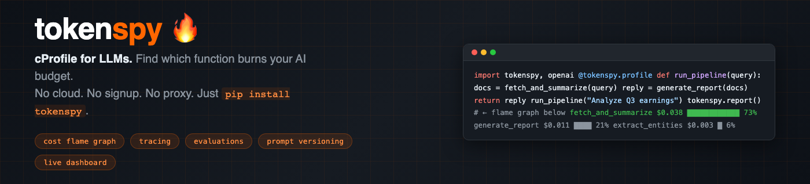

<div align="center">

<h3>
  <a href="https://pinakimishra95.github.io/tokenspy"><strong>Docs</strong></a> ·
  <a href="https://pinakimishra95.github.io/tokenspy/tracing/"><strong>Tracing</strong></a> ·
  <a href="https://pinakimishra95.github.io/tokenspy/evals/"><strong>Evals</strong></a> ·
  <a href="https://pinakimishra95.github.io/tokenspy/dashboard/"><strong>Dashboard</strong></a> ·
  <a href="https://github.com/pinakimishra95/tokenspy/issues"><strong>Issues</strong></a>
</h3>

[](https://pypi.org/project/tokenspy/)
[](https://pypi.org/project/tokenspy/)
[](https://github.com/pinakimishra95/tokenspy/actions)
[](https://www.python.org/downloads/)
[](https://opensource.org/licenses/MIT)
[](https://pypi.org/project/tokenspy/)

```bash
pip install tokenspy
```

</div>

---

## 🔥 The Problem

You get an OpenAI invoice for **$800 this month**. You have no idea which function caused it.

Langfuse and Braintrust require you to **sign up, configure API keys, and reroute traffic through their cloud proxy** just to see what's happening. tokenspy intercepts in-process — **one decorator, no proxy, no account, no monthly fee**.

---

## ⚡ Fix It in One Line

```python
import tokenspy

@tokenspy.profile
def run_pipeline(query):
    docs = fetch_and_summarize(query)    # ← costs $0.038?
    entities = extract_entities(docs)   # ← or this?
    return generate_report(entities)    # ← or this?

run_pipeline("Analyze Q3 earnings")
tokenspy.report()
```

```
╔══════════════════════════════════════════════════════════════════════╗
║  tokenspy cost report                                                ║
║  total: $0.0523  ·  18,734 tokens  ·  3 calls                       ║
╠══════════════════════════════════════════════════════════════════════╣
║  fetch_and_summarize      $0.038  ████████████░░░░  73%             ║
║    └─ gpt-4o               $0.038  ████████████░░░░  73%            ║
║  generate_report          $0.011  ████░░░░░░░░░░░░  21%            ║
║  extract_entities         $0.003  █░░░░░░░░░░░░░░░   6%            ║
╠══════════════════════════════════════════════════════════════════════╣
║  🔴 fetch_and_summarize → switch to gpt-4o-mini: 94% cheaper        ║
╚══════════════════════════════════════════════════════════════════════╝
```

**Now you know: `fetch_and_summarize` is burning 73% of your budget.**

---

## ✨ Full Observability Stack — v0.2.0

Everything Langfuse and Braintrust do, without sending a single byte to the cloud.

| Feature | v0.1 | v0.2.0 |
|---|---|---|
| Cost flame graph | ✅ | ✅ |
| Budget alerts | ✅ | ✅ |
| SQLite persistence | ✅ | ✅ |
| **Structured tracing (Trace + Span)** | ❌ | ✅ |
| **OpenTelemetry export** | ❌ | ✅ |
| **Evaluations + datasets** | ❌ | ✅ |
| **Prompt versioning** | ❌ | ✅ |
| **Live web dashboard** | ❌ | ✅ |

---

## 🖥️ Live Dashboard

```bash
pip install tokenspy[server]
tokenspy serve   # → http://localhost:7234
```


**5 tabs:** Overview · Traces · Evaluations · Prompts · Settings — all your LLM data, local, real-time.

---

## 🚀 Quick Start

### Tracing

```python
tokenspy.init(persist=True)

with tokenspy.trace("pipeline", input={"query": q}) as t:
    with tokenspy.span("retrieve") as s:
        docs = fetch(q);  s.update(output=docs)
    with tokenspy.span("generate", span_type="llm") as s:
        answer = llm_call(docs)   # ← auto-linked to span
    t.update(output=answer)

t.score("quality", 0.9)
```

### Evaluations

```python
from tokenspy.eval import scorers

ds = tokenspy.dataset("qa-golden")
ds.add(input={"q": "Capital of France?"}, expected_output="Paris")

exp = tokenspy.experiment("gpt4o-mini-v1", dataset="qa-golden",
                          fn=my_fn, scorers=[scorers.exact_match])
exp.run().summary()
```

### Prompt versioning

```python
p = tokenspy.prompts.push("summarizer", "Summarize in {{style}}: {{text}}")
p.compile(style="concise", text="...")
tokenspy.prompts.set_production("summarizer", version=2)
```

### Budget alerts

```python
@tokenspy.profile(budget_usd=0.10, on_exceeded="raise")
def strict_agent(query): ...
# raises BudgetExceededError if cost > $0.10
```

---

## 🆚 tokenspy vs Langfuse vs Braintrust

| | Langfuse | Braintrust | **tokenspy** |
|---|---|---|---|
| Requires cloud proxy | ✅ yes | ✅ yes | **❌ no** |
| Requires signup | ✅ yes | ✅ yes | **❌ no** |
| Data leaves your machine | ✅ yes | ✅ yes | **❌ never** |
| Works offline | ❌ no | ❌ no | **✅ yes** |
| Zero core dependencies | ❌ no | ❌ no | **✅ yes** |
| Structured tracing | ✅ yes | ✅ yes | **✅ yes** |
| Evaluations + datasets | ✅ yes | ✅ yes | **✅ yes** |
| LLM-as-judge scoring | ✅ yes | ✅ yes | **✅ yes** |
| Prompt versioning | ✅ yes | ✅ yes | **✅ yes** |
| OpenTelemetry export | ⚡ partial | ❌ no | **✅ yes** |
| **Flame graph by function** | ❌ no | ❌ no | **✅ yes** |
| **`@decorator` API** | ❌ no | ❌ no | **✅ yes** |
| **Budget alerts** | ⚡ partial | ⚡ partial | **✅ yes** |
| **Git commit cost tracking** | ❌ no | ❌ no | **✅ yes** |
| **GitHub Actions cost diff** | ❌ no | ❌ no | **✅ yes** |
| Monthly cost | $0–$250 | $0–$300 | **free forever** |

---

## 🔌 Integrations

| Provider | Auto-instrumented |
|---|---|
| **OpenAI** | `chat.completions.create` (sync + async + streaming) |
| **Anthropic** | `messages.create` (sync + async + streaming) |
| **Google Gemini** | `generate_content` |
| **LangChain / LangGraph** | Callback handler |

**Exports:** OpenTelemetry → Grafana, Jaeger, Datadog, Honeycomb ([docs](https://pinakimishra95.github.io/tokenspy/otel/))

**CI:** GitHub Actions cost diff per PR ([docs](https://pinakimishra95.github.io/tokenspy/ci/))

---

## 📦 Install

```bash
pip install tokenspy              # core (zero dependencies)
pip install tokenspy[otel]        # + OpenTelemetry export
pip install tokenspy[server]      # + web dashboard (fastapi + uvicorn)
pip install tokenspy[all]         # openai + anthropic + langchain
```

---

## 📚 Documentation

**[→ Full documentation at pinakimishra95.github.io/tokenspy](https://pinakimishra95.github.io/tokenspy)**

| Guide | Description |
|---|---|
| [Tracing](https://pinakimishra95.github.io/tokenspy/tracing/) | Trace + Span context managers, auto LLM linking, scores |
| [Evaluations & Datasets](https://pinakimishra95.github.io/tokenspy/evals/) | Datasets, scorers, llm_judge, experiment comparison |
| [Prompt Versioning](https://pinakimishra95.github.io/tokenspy/prompts/) | push / pull / compile / set_production |
| [Web Dashboard](https://pinakimishra95.github.io/tokenspy/dashboard/) | Local dashboard, REST API |
| [OpenTelemetry](https://pinakimishra95.github.io/tokenspy/otel/) | OTEL export to Grafana, Jaeger, Datadog |
| [GitHub Actions](https://pinakimishra95.github.io/tokenspy/ci/) | Cost diff annotations per PR |

---

## 🤝 Contributing

```bash
git clone https://github.com/pinakimishra95/tokenspy
cd tokenspy && pip install -e ".[dev]"
pytest tests/   # 139 tests, ~0.3s
```

Issues and PRs welcome — especially new provider support and pricing updates.

---

## License

MIT © [Pinaki Mishra](https://github.com/pinakimishra95). See [LICENSE](LICENSE).

---

<div align="center">

**Everything Langfuse and Braintrust do. Zero cloud. Zero signup. Zero cost.**

[GitHub](https://github.com/pinakimishra95/tokenspy) · [PyPI](https://pypi.org/project/tokenspy/) · [Docs](https://pinakimishra95.github.io/tokenspy) · [Issues](https://github.com/pinakimishra95/tokenspy/issues)

</div>
