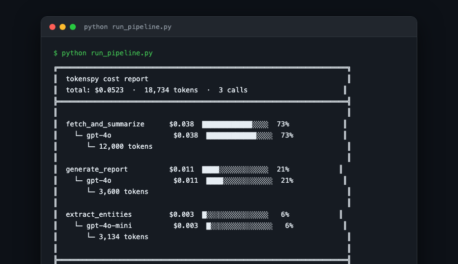

# tokenspy 🔥

<div align="center">

**The local-first LLM observability stack. No cloud. No signup. No proxy.**

[](https://pypi.org/project/tokenspy/)
[](https://github.com/pinakimishra95/tokenspy/actions)
[](https://www.python.org/downloads/)
[](https://opensource.org/licenses/MIT)

```bash
pip install tokenspy
```



</div>

---

## The Problem

You get an OpenAI invoice for **$800 this month**. You have no idea which function caused it.

tokenspy tells you instantly — **one decorator, zero config, zero cloud**.

---

## Fix It in One Line

```python
import tokenspy

@tokenspy.profile
def run_pipeline(query):
    docs = fetch_and_summarize(query)
    entities = extract_entities(docs)
    return generate_report(entities)

run_pipeline("Analyze Q3 earnings")
tokenspy.report()   # → flame graph printed above
```

---

## v0.2.0 — Full Observability Stack

Everything Langfuse and Braintrust do — without sending a single byte to the cloud.

| Feature | v0.1 | v0.2.0 |
|---|---|---|
| Cost flame graph | ✅ | ✅ |
| Budget alerts | ✅ | ✅ |
| SQLite persistence | ✅ | ✅ |
| **Structured tracing (Trace + Span)** | ❌ | ✅ |
| **OpenTelemetry export** | ❌ | ✅ |
| **Evaluations + datasets** | ❌ | ✅ |
| **Prompt versioning** | ❌ | ✅ |
| **Live web dashboard** | ❌ | ✅ |

---

## Quick Start

### Minimal

```python
import tokenspy

@tokenspy.profile
def my_function():
    return openai.chat.completions.create(model="gpt-4o", messages=[...])

my_function()
tokenspy.report()
```

### Full v0.2.0

```python
import tokenspy

tokenspy.init(persist=True, track_git=True)

# Structured tracing — auto-links LLM calls to spans
with tokenspy.trace("pipeline", input={"query": q}) as t:
    with tokenspy.span("retrieve") as s:
        docs = fetch(q)
        s.update(output=docs)
    with tokenspy.span("generate", span_type="llm") as s:
        answer = llm_call(docs)
    t.update(output=answer)

t.score("quality", 0.9)

# Prompt versioning
p = tokenspy.prompts.push("summarizer", "Summarize in {{style}}: {{text}}")
compiled = p.compile(style="concise", text="...")

# Evaluations
ds = tokenspy.dataset("qa-golden")
ds.add(input={"q": "Capital of France?"}, expected_output="Paris")
exp = tokenspy.experiment("gpt4o-mini-v1", dataset="qa-golden", fn=my_fn,
                          scorers=[scorers.exact_match])
exp.run().summary()

# Live dashboard
# tokenspy serve   →  http://localhost:7234
```

```bash
tokenspy serve          # open dashboard
tokenspy history        # call log
tokenspy report         # flame graph
```

---

## vs. Langfuse and Braintrust

| | Langfuse | Braintrust | **tokenspy** |
|---|---|---|---|
| Requires proxy / cloud | ✅ | ✅ | **❌ fully local** |
| Requires signup | ✅ | ✅ | **❌ no** |
| Data leaves your machine | ✅ | ✅ | **❌ never** |
| Works offline | ❌ | ❌ | **✅ yes** |
| Zero dependencies (core) | ❌ | ❌ | **✅ yes** |
| Structured tracing | ✅ | ✅ | **✅ yes** |
| Evaluations + datasets | ✅ | ✅ | **✅ yes** |
| Prompt versioning | ✅ | ✅ | **✅ yes** |
| OpenTelemetry export | ⚡ partial | ❌ | **✅ yes** |
| **Flame graph by function** | ❌ | ❌ | **✅ yes** |
| **`@decorator` API** | ❌ | ❌ | **✅ yes** |
| **Budget alerts** | ⚡ partial | ⚡ partial | **✅ yes** |
| **Git commit cost tracking** | ❌ | ❌ | **✅ yes** |
| **GitHub Actions cost diff** | ❌ | ❌ | **✅ yes** |
| Monthly cost | $0–$250 | $0–$300 | **free forever** |

---

## Install

```bash
pip install tokenspy              # core (zero deps)
pip install tokenspy[otel]        # + OpenTelemetry export
pip install tokenspy[server]      # + web dashboard (fastapi + uvicorn)
pip install tokenspy[all]         # openai + anthropic + langchain
```

**Supported providers:** OpenAI · Anthropic · Google Gemini · LangChain/LangGraph

---

## Docs

**[→ Full documentation](https://pinakimishra95.github.io/tokenspy)**

- [Tracing guide](https://pinakimishra95.github.io/tokenspy/tracing/)
- [Evaluations & datasets](https://pinakimishra95.github.io/tokenspy/evals/)
- [Prompt versioning](https://pinakimishra95.github.io/tokenspy/prompts/)
- [Web dashboard](https://pinakimishra95.github.io/tokenspy/dashboard/)
- [OpenTelemetry export](https://pinakimishra95.github.io/tokenspy/otel/)
- [GitHub Actions cost diff](https://pinakimishra95.github.io/tokenspy/ci/)

---

## Contributing

```bash
git clone https://github.com/pinakimishra95/tokenspy
cd tokenspy
pip install -e ".[dev]"
pytest tests/
```

Issues and PRs welcome — especially new provider support and pricing updates.

---

## License

MIT © [Pinaki Mishra](https://github.com/pinakimishra95). See [LICENSE](LICENSE).

---

<div align="center">

**Everything Langfuse and Braintrust do. Zero cloud. Zero signup. Zero cost.**

[GitHub](https://github.com/pinakimishra95/tokenspy) · [PyPI](https://pypi.org/project/tokenspy/) · [Docs](https://pinakimishra95.github.io/tokenspy) · [Issues](https://github.com/pinakimishra95/tokenspy/issues)

</div>
